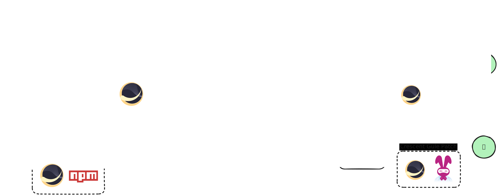

  <h1 align="center">Crescent</h1>

</a>

  一套为 MoonBit 设计的多后端 API 解决方案

  View this document in English | 简体中文

## MoonBit 多后端 FFI 存在的问题？ (Why)

现在 MoonBit 语言可以编译到 WebAssembly 与 JavaScript 两个平台的代码，并且希望建立基于 MoonBit 语言本身的一套生态，但是不免有以下的情况：

- 有些函数必定要从宿主环境当中获取（比如带有副作用的函数，或者一些 Web 的类库）

- 有些函数虽然可以从 MoonBit 实现，但效果并不好，可能还需要 FFI 来解决问题，一个非常经典的例子就是在 WebAssembly 环境中的[三角函数](https://stackoverflow.com/questions/48014858/webassembly-trig-functions-possible)表现欠佳。

一旦涉及了 FFI，就有更多的问题：

- 如果你给一个库编写了一个 bindings 发在 mooncakes，那么编译出的 wasm 在 js 端导入时会面临一个“最后一步”的问题——使用你 package 的用户不知道要在 js 端给 wasm 传入什么函数。除非你在 npm 再分发一个 js glue，而如果这种情况多了，用户就要对每个库都寻找一次他们的 glue 是怎么做的，仿佛回到了 C/C++ 的依赖解决，我们缺乏一套通用的解决方案。

- 就算第一步解决了，你编写的 bindings 往往只能给 wasm 或 js 一端使用，另外一端则可能需要在 MoonBit 这一端使用其他的 bindings。也就是说你在编写 MoonBit 代码时，使用的 bindings 要对编译的目标后端 case by case，如果要服务两个后端的用户，就需要编写两套代码。

- 同时目前随着 wasmtime 等独占式 wasm-runtime 的发展，wasm 如何本地化的运行也是一个值得讨论的话题。包括 MoonBit 官方都提供了一个基于 rusty-v8 的 runtime。如果用户希望自己使用的 bindings 在这里也可以使用呢？

## 我们想做什么？ (What/How)

问题不出在 MoonBit 语言本身，其实 FFI 解决方案不佳对多后端、新兴的语言来说是再正常不过的事情。

基于上面提出的问题，我们希望提出一套通用的 FFI 解决方案。让用户可以在 MoonBit 端仅使用一套 bindings ，就能在 wasm/js/独占式的wasm-runtime 三个场景下使用。

</a>

- 对于 wasm/js 后端，我们在 npm 发布对于它们的 Crescent 适配 toolchain。这条 toolchain 可以直接帮助用户解决 wasm/js 的 import 问题。

- 对于独占式的 wasm-runtime，我们可以对他们的胶水层代码进行 patch，将用户使用的 bindings 中需要 import 的函数导入到运行环境当中。（目前我们仅对 moonrun 进行了调研，还需要进一步讨论实现方案）

## 接下来我们怎么做？ (RoadMap)

- [x] 完成思路明确与原理验证
- [ ] 发布第一个示例 bindings 库
- [ ] 开放社区自由贡献 bindings
- [ ] 开发用于 FFI 库制作的工具（如 moon info 与 .d.ts 的互转）
- [ ] 开发制作成熟的 FFI bindings 制作框架（多后端胶水一站式生成）

## 其他

欢迎在本仓库的 Issues 提出对于 Crescent 的问题/建议！
